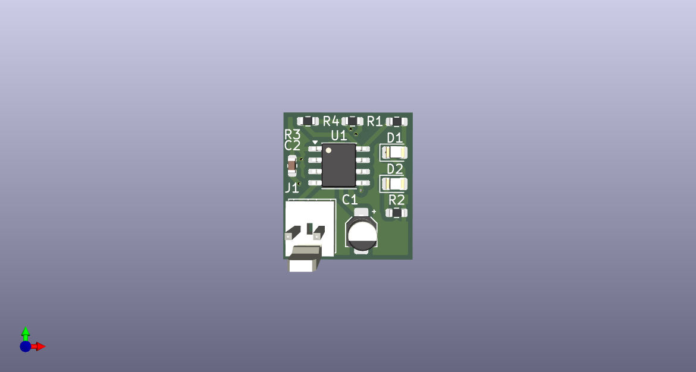

# NE555 ile Basit Flip-Flop Devresi

Bu proje, **NE555 zamanlayıcı entegresi** kullanılarak tasarlanmış basit bir flip-flop devresini içermektedir.  
Devre şeması **KiCad** ile çizilmiştir.
TH ve SMD versiyonları vardır. 

## Özellikler
- NE555 entegresi ile bistable flip-flop davranışı
- LED’ler ile çıkış durumunun gözlemlenmesi
- KiCad dosyaları dahil edilmiştir

## Dosya Yapısı
- `SMD-flipflop-NE555/` → SMD versiyonun dosyaları.
    - `flipflop_NE555/` → KiCad şematik dosyaları, PCB tasarım dosyaları  
    - `images/` → Devre şeması ve PCB görselleri
    - `output_gerber/` → Gerber dosyaları
- `TH-flipflop-NE555/` → TH versiyonun dosyaları.
    - `flipflop_NE555/` → KiCad şematik dosyaları, PCB tasarım dosyaları  
    - `images/` → Devre şeması ve PCB görselleri
    - `output_gerber/` → Gerber dosyaları
- `README.md` → Bu dosya 

## Gereksinimler
- KiCad (9.x veya üzeri sürüm)
- Standart elektronik bileşenler:
  - NE555 entegresi
  - 2x LED
  - Dirençler, kapasitörler
  - Konnektör

## Devre Görseli

## Çalışma Prensibi
- Devre, basit bir flip-flop mantığı ile 5V bağlantısıyla çalışır.

## Katkı
Geliştirmelere ve önerilere açıktır. Pull request gönderebilirsiniz.
